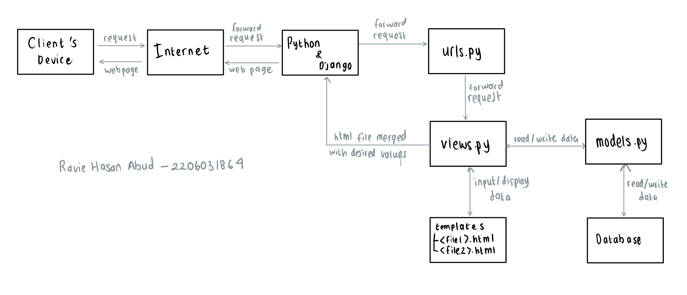

# Vending Machine Inventory
#### https://vending-machine.adaptable.app/main/
#### by Ravie Hasan Abud - 2206031864 - PBP A
<hr>

## 1. Jelaskan bagaimana cara kamu mengimplementasikan checklist di atas secara step-by-step (bukan hanya sekadar mengikuti tutorial).

### Cara Pengerjaan Checklist
- [ ] Membuat sebuah proyek Django baru. <br>
    - Membuat directory baru bernama `vending_machine` yang akan dijadikan local directory/repository dari github repository
    - Membuka CMD pada directory `vending_machine` dan menjalankan `git init`,  `git config user.name ...`, dan `git config user.email ...` untuk konfigurasi github
    - Membuat reporitory github baru bernama `vending-machine`
    - Membuat file `README.md` dan mengeditnya melalui VSCODE
    - Menjalankan `git branch -M main`, `git remote add origin ...`, dan `git push -u origin main` untuk membuat main branch dengan nama `main`, menghubungkan local directory/repository dengan repository github, dan push/update semua perubahan ke github
    - Menjalankan `python -m venv env` untuk membuat virtual environment untuk directory agar dapat maintain versi-versi django dan lain sebagainya yang dipakai di device
    - Menjalankan `env\Scripts\activate.bat` untuk mengaktifkan virtual environment
    - Membuat file baru bernama `requirements.txt` dan mengisinya dengan hal-hal yang ingin diinstall agar tidak terlalu banyak menjalankan command `pip install ...`, saya megnisinya dengan:
      ```bash
      django
      gunicorn
      whitenoise
      psycopg2-binary
      requests
      urllib3
      ```
    - Menjalankan `pip install -r requirements.txt` untuk install hal-hal yang telah ditambahkan pada `requirements.txt` tadi
    - Menjalankan `django-admin startproject vending_machine .`
    - Membuka file `settings.py` dan ubah `ALLOWED_HOSTS = []` menjadi `ALLOWED_HOSTS = ["*"]` karena akan diperlukan untuk proses deployment 
    - Membuat file baru bernama `.gitignore` untuk memberikan informasi mengenai berkas yang perubahannya tidak perlu ditrack oleh Git, saya mengisina dengan:
    ```bash
    # Django
    *.log
    *.pot
    *.pyc
    __pycache__
    db.sqlite3
    media
    
    # Backup files
    *.bak 
    
    # If you are using PyCharm
    # User-specific stuff
    .idea/**/workspace.xml
    .idea/**/tasks.xml
    .idea/**/usage.statistics.xml
    .idea/**/dictionaries
    .idea/**/shelf
    
    # AWS User-specific
    .idea/**/aws.xml
    
    # Generated files
    .idea/**/contentModel.xml
    
    # Sensitive or high-churn files
    .idea/**/dataSources/
    .idea/**/dataSources.ids
    .idea/**/dataSources.local.xml
    .idea/**/sqlDataSources.xml
    .idea/**/dynamic.xml
    .idea/**/uiDesigner.xml
    .idea/**/dbnavigator.xml
    
    # Gradle
    .idea/**/gradle.xml
    .idea/**/libraries
    
    # File-based project format
    *.iws
    
    # IntelliJ
    out/
    
    # JIRA plugin
    atlassian-ide-plugin.xml
    
    # Python
    *.py[cod] 
    *$py.class 
    
    # Distribution / packaging 
    .Python build/ 
    develop-eggs/ 
    dist/ 
    downloads/ 
    eggs/ 
    .eggs/ 
    lib/ 
    lib64/ 
    parts/ 
    sdist/ 
    var/ 
    wheels/ 
    *.egg-info/ 
    .installed.cfg 
    *.egg 
    *.manifest 
    *.spec 
    
    # Installer logs 
    pip-log.txt 
    pip-delete-this-directory.txt 
    
    # Unit test / coverage reports 
    htmlcov/ 
    .tox/ 
    .coverage 
    .coverage.* 
    .cache 
    .pytest_cache/ 
    nosetests.xml 
    coverage.xml 
    *.cover 
    .hypothesis/ 
    
    # Jupyter Notebook 
    .ipynb_checkpoints 
    
    # pyenv 
    .python-version 
    
    # celery 
    celerybeat-schedule.* 
    
    # SageMath parsed files 
    *.sage.py 
    
    # Environments 
    .env 
    .venv 
    env/ 
    venv/ 
    ENV/ 
    env.bak/ 
    venv.bak/ 
    
    # mkdocs documentation 
    /site 
    
    # mypy 
    .mypy_cache/ 
    
    # Sublime Text
    *.tmlanguage.cache 
    *.tmPreferences.cache 
    *.stTheme.cache 
    *.sublime-workspace 
    *.sublime-project 
    
    # sftp configuration file 
    sftp-config.json 
    
    # Package control specific files Package 
    Control.last-run 
    Control.ca-list 
    Control.ca-bundle 
    Control.system-ca-bundle 
    GitHub.sublime-settings 
    
    # Visual Studio Code
    .vscode/* 
    !.vscode/settings.json 
    !.vscode/tasks.json 
    !.vscode/launch.json 
    !.vscode/extensions.json 
    .history
    ```
    <hr>

- [ ] Membuat aplikasi dengan nama `main` pada proyek tersebut.<br>
    - Masih pada CMD yang sama, jalankan `python manage.py startapp main` untuk membuat django app baru bernama `main` pada django project bernama `vending_machine`
    - Membuka file `settings.py` dan tambahkan `'main'` pada variabel `INSTALLED_APPS`
    - Membuka directory `main` dan buat directory baru bernama `templates` untuk menyimpan file `.html` yang akan digunakan karena django menggunakan Model-View-Template (MVT) 
    - Membuat file baru bernama `main.html` pada directory `templates` dan mengisinya dengan konten-konten yang diperlukan. Untuk Tugas 2, yang wajib muncul adalah nama aplikasi, nama, dan kelas
    <hr>

- [ ] Melakukan *routing* pada proyek agar dapat menjalankan aplikasi `main`. <br>
    - Membuka file `urls.py` pada directory `vending_machine`
    - Menambahkan `from django.urls import path, include`
    - Mengubah `urlpatterns` menjadi:
    ```bash
    urlpatterns = [
    path('admin/', admin.site.urls),
    path('main/', include('main.urls')),
    ]
    ```
    Note:
    - `path('main/', include('main.urls')),` digunakan untuk menambahkan routing dari `urls.py` pada directory `main` dan url yang ada pada `urls.py` di `main` akan menjadi `.../main/...`
    <hr>

- [ ] Membuat model pada aplikasi `main` dengan nama `Item` dan memiliki atribut wajib sebagai berikut.
    - `name` sebagai nama *item* dengan tipe `CharField`.
    - `amount` sebagai jumlah *item* dengan tipe `IntegerField`.
    - `description` sebagai deskripsi *item* dengan tipe `TextField`.
    <br>
    
    - Membuka `models.py` dan mengisinya dengan attributes/fields yang diperlukan. Pada kasus ini, saya menggunakan 5 attributes, yakni `name` (CharField), `amount` (IntegerField), `description` (TextField), `price` (IntegerField), dan `date_added` (DateField). Isi file `models.py` adalah sebagai berikut:
    ```bash
    from django.db import models

    class Product(models.Model):
        name = models.CharField(max_length=255, name="name")
        amount = models.IntegerField(name="amount")
        description = models.TextField(name="description")
        price = models.IntegerField(name="price")
        date_added = models.DateField(auto_now_add=True, name="date_added")

        def __str__(self):
            return f"Name: {self.name} {self.amount} {self.price} {self.date_added} {self.description}"
    .
    ```
    Note:
    - `__str__` diperlukan untuk keperluan unit tests
    <hr>

- [ ] Membuat sebuah fungsi pada `views.py` untuk dikembalikan ke dalam sebuah *template* HTML yang menampilkan nama aplikasi serta nama dan kelas kamu. <br>
    - Membuka `views.py` dan menambahkan potongan kode di bawah ini untuk menghubungkan Views dan Templates (e.g.: substitute `{{ <desired_variable> }}` pada file-file di directory `templates`). Saya memerlukan variables `name`, `class`, `student_id`, dan `products` (berisi detail setiap product yang ada). Sehingga, isi `views.py` sebagai berikut:
    ```bash
    from django.shortcuts import render
    from .models import Product

    def show_main(request):
        context = {
            'name': 'Ravie Hasan Abud',
            'class': 'PBP A',
            'student_id': '2206031864',
        }

        return render(request, "main.html", context)

    def show_products(request):
        products = Product.objects.all().values()
        context = {
            'products' : products,
        }

        return render(request, "products.html", context)
    ```
    Notes: 
    - show_main digunakan untuk  `https://vending-machine.adaptable.app/main/`
    - show_products digunakan untuk `https://vending-machine.adaptable.app/main/products/` 
    <hr>

- [ ] Membuat sebuah *routing* pada `urls.py` aplikasi `main` untuk memetakan fungsi yang telah dibuat pada `views.py`. <br>
    - ubah `urlpatterns` menjadi seperti ini:
    ```bash
    urlpatterns = [
        path('', show_main, name='show_main'), 
        path('products/', show_products, name='show_product')
    ]
    ```
    Notes:
    - `products/` = ketika mengakses `.../main/products/` akan memanggil `show_products` dari `views.py`
    - `''` = ketika mengakses `.../main/` akan memanggil `show_main` dari `views.py`
    <hr>

- [ ] Melakukan *deployment* ke Adaptable terhadap aplikasi yang sudah dibuat sehingga nantinya dapat diakses oleh teman-temanmu melalui Internet. <br>
    - Menjalankan `git pull origin main`, `git add <desired_file>`, `git commit -m "<desired_message>"`, dan `git push -u origin main` untuk update github repository agar sesuai dengan locak repository
    - Klik `New App` -> `Connect an Existing Repository` -> `raviehasan/vending-machine` -> `main` -> `Python App Template` -> `PostgreSQL` -> python version = `3.10` (laptop saya menggunakan python version 3.10) -> `Start Command` dan tambahkan `python manage.py migrate && gunicorn vending_machine.wsgi` -> enable `HTTP Listener on PORT` -> `Deploy App` 
    - Jika deployment sudah berhasil, periksa `https://vending-machine.adaptable.app/main/` dan `https://vending-machine.adaptable.app/main/products/` untuk memastikan deployment berjalan dengan lancar
    <hr>

### Cara Pengerjaan Bonus (Unit Tests)
- Membuka directory `main` 
- Membuka `tests.py` mengisinya dengan tests yang diinginkan
- Saya ingin tes apakah url `.../main/` dan `.../main/products/` ada, maka perlu import `TestCase` dam `Client`
- Saya ingin tes model juga, sehingga perlu import `Product` dari `models.py`
```bash
from django.test import TestCase, Client
from .models import Product
from django.utils import timezone

class MainTest(TestCase):
    def test_main_url_is_exist(self):
        response = Client().get('/main/')
        self.assertEqual(response.status_code, 200)

    def test_main_using_main_template(self):
        response = Client().get('/main/')
        self.assertTemplateUsed(response, 'main.html')

    def test_main_products_url_is_exist(self):
        response = Client().get('/main/products/')
        self.assertEqual(response.status_code, 200)

    def test_main_products_using_products_template(self):
        response = Client().get('/main/products/')
        self.assertTemplateUsed(response, 'products.html')

class TestModels(TestCase):
    @classmethod
    def setUpTestData(cls):
        Product.objects.create(name="Chitato", amount=100, price=10000, date_added=timezone.now, description="Chips")

    def test_string_method(self):
        product = Product.objects.get(id=1)
        expected_string = f"Name: {product.name} {product.amount} {product.price} {product.date_added} {product.description}"
        self.assertEqual(str(product), expected_string)
```
- Jalankan `python manage.py test` untuk mengecek apakah test sudah sukses
- Jalankan `coverage run --source='.' manage.py test` untuk menjalankan tes dan mengumpulkan coverage data
- Jalankan `coverage run --source='.' manage.py test` untuk melihat report dari coverage data
Notes:
- `test_main_url_is_exist` digunakan untuk test apakah terdapat url `https://vending-machine.adaptable.app/main/`
- `test_main_using_main_template` digunakan untuk test apakah `https://vending-machine.adaptable.app/main/` menggunakan `main.html` sebagai template
- `test_main_products_url_is_exist` digunakan untuk test apakah terdapat url `https://vending-machine.adaptable.app/main/products/`
- `test_main_products_using_products_template` digunakan untuk test apakah `https://vending-machine.adaptable.app/main/` menggunakan `main.html` sebagai template
- `setUpTestData` digunakan untuk membuat objek baru dengan attributes yang diinginkan dijadikan argumen 
- `test_string_method` digunakan untuk test apakah objek yang telah dibuat memiliki atribut yang sesuai
<hr>

## 2. Buatlah bagan yang berisi request client ke web aplikasi berbasis Django beserta responnya dan jelaskan pada bagan tersebut kaitan antara urls.py, views.py, models.py, dan berkas html

- Client mengirim request ke Internet -> forward ke Python/Django -> forward ke urls.py -> forward ke views.py untuk memproses url -> read/write data dari/ke models.py dan database -> input/display data dari/ke templates -> return html file yang telah dimerge dengan value-value yang diinginkan -> proses ke internet -> display ke client's device
<hr>

## 3. Jelaskan mengapa kita menggunakan virtual environment? Apakah kita tetap dapat membuat aplikasi web berbasis Django tanpa menggunakan virtual environment?
- Virtual environment dapat mengisolasi dependencies untuk masing-masing django project. Tujuannya adalah karena dapat mempermudah ketika kita berkolaborasi dengan orang lain karena orang tersebut dapat include dependencies (python version, django version, etc.) yang digunakan pada django project kita. Dengan alasan yang sama, virtual environment juga memungkinkan kita untuk dapat mengerjakan project yang sama melalui berbagai device berbeda dengan cara include dependencies dari project tersebut.
- Walaupun demikian, kita tetap dapat membuat aplikasi web berbasis Django tanpa menggunakan virtual environment. Hanya saja ada banyak risiko muncul error, dimulai dari bibsa terjadi konflik antar project karena dependencies antar project (misal perbedaan versi python dan django, etc.), akan lebih sulit untuk melakukan development project, hingga risiko gagal melakukan deploy juga cukup tinggi karena hal-hal tersebut.
<hr>

## 4. Jelaskan apakah itu MVC, MVT, MVVM dan perbedaan dari ketiganya.
- <b>MVC (Model-View-Controller)</b>
    - Model: untuk mencari dan mengolah data yang diminta oleh Database
    - View: menampilkan data dengan design yang dibuat di sini (kurang lebih seperti Template pada MVT dan View pada MVVM)
    - Controller: mengatur bagaimana data akan ditampilkan di View (kurang lebih seperti View pada MVT)
    - Input diterima oleh Controller
    - Kurang cocok untuk aplikasi berskala kecil
- <b>MVT (Model-View-Template)</b>
    - Model: untuk mencari dan mengolah data yang diminta oleh database
    - View: mengatur bagaimana data akan ditampilkan di Template (kurang lebih seperti Controller pada MVC)
    - Template: menampilkan data dengan design yang dibuat di sini (kurang lebih seperti View pada MVC dan MVVM)
    - Input diterima oleh View
    - Cocok digunakan baik untuk aplikasi berskala besar maupun kecil
    - Mudah melakukan modifikasi
- <b>MVVM (Model-View-ViewModel)</b>
    - Model: tempat untuk menyimpan informasi
    - View: menampilkan data dengan design yang dibuat di sini (kurang lebih seperti View pada MVC dan Template pada MVVM)
    - ViewModel: menghubungkan Model dan View
    - Input diterima oleh View
    - Kurang cocok untuk palikasi berskala kecil
    - Memiliki kelebihan dalam proses binding data
